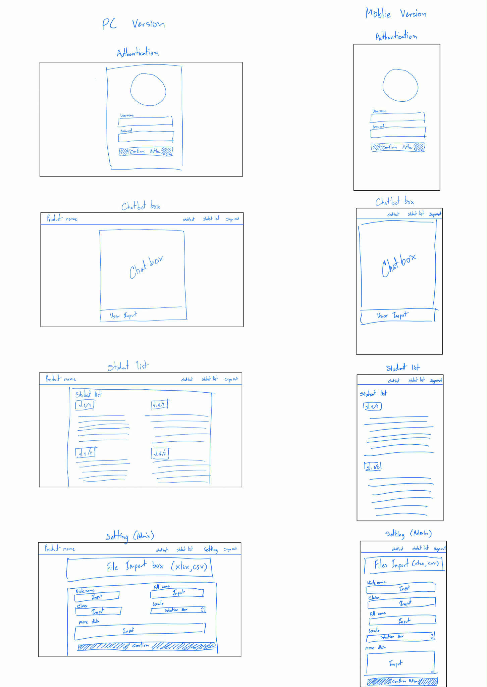
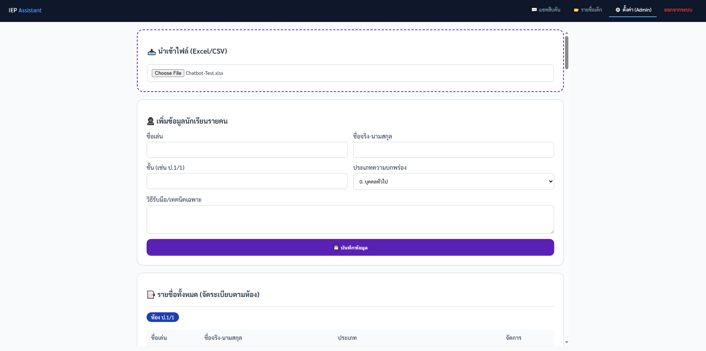
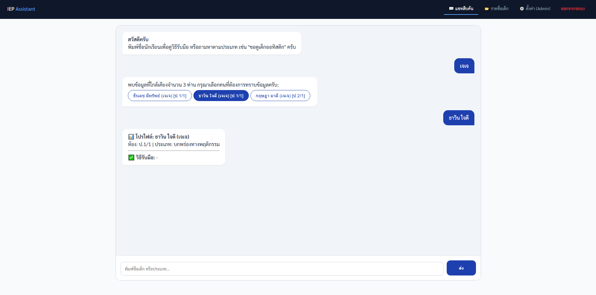

ข้อเสนอโครงการ
วิชา CP413601 การประยุกต์ใช้งานปัญญาประดิษฐ์ในกิจการสาธารณะ

สมาชิกในกลุ่ม

อาจารย์ที่ปรึกษา: รศ.ดร. ณรงค์ เกียรติคุณวงศ์

1. ชื่อโครงการ (Project Title)
แชทบอทแนะนำแผนการจัดการศึกษาเฉพาะบุคคล (IEP) สำหรับเด็กพิเศษทุกประเภท โดยใช้เทคโนโลยีปัญญาประดิษฐ์ (AI)
2. ความเป็นมาของปัญหาและความสำคัญ (Background & Problem Statement)
เด็กที่มีความต้องการพิเศษในระบบการศึกษาไทยยังประสบปัญหาการได้รับแผนการจัดการศึกษาเฉพาะบุคคล (IEP) ที่เหมาะสมกับศักยภาพและความแตกต่างของแต่ละบุคคลอย่างแท้จริง แม้ว่านโยบายการเรียนรวมและกฎหมายจะรับรองสิทธิทางการศึกษาอย่างเท่าเทียม แต่ในทางปฏิบัติ ครูและสถานศึกษายังขาดเครื่องมือที่ช่วยวิเคราะห์ข้อมูล วางแผน และปรับ IEP ได้อย่างมีประสิทธิภาพ ส่งผลให้การจัดการเรียนรู้ไม่ต่อเนื่อง และเด็กไม่สามารถพัฒนาได้เต็มศักยภาพ
ดังนั้น จึงมีความจำเป็นในการพัฒนาเครื่องมือดิจิทัลอัจฉริยะ เช่น แชทบอทที่ใช้เทคโนโลยีปัญญาประดิษฐ์ (AI) เพื่อช่วยแนะนำแนวทางการจัดทำ IEP รายบุคคล เพื่อสนับสนุนการทำงานของครู ลดภาระงาน และยกระดับคุณภาพการศึกษาสำหรับเด็กที่มีความต้องการพิเศษทุกประเภทอย่างยั่งยืน
บริบทเชิงนโยบายและข้อจำกัดของภาครัฐ
โครงการแชทบอทแนะนำแผนการจัดการศึกษาเฉพาะบุคคล (Individualized Education Program: IEP) สำหรับเด็กที่มีความต้องการพิเศษ โดยใช้เทคโนโลยีปัญญาประดิษฐ์ (AI) เป็นโครงการที่สอดคล้องกับกรอบนโยบายการพัฒนาประเทศตาม ยุทธศาสตร์ชาติ พ.ศ. 2561–2580 และ แผนยุทธศาสตร์ชาติ 20 ปี ซึ่งมุ่งเน้นการพัฒนาทรัพยากรมนุษย์ การสร้างความเสมอภาคทางสังคม และการยกระดับประสิทธิภาพการบริหารจัดการภาครัฐด้วยเทคโนโลยีดิจิทัล
โครงการนี้สอดคล้องกับ ยุทธศาสตร์ชาติด้านการพัฒนาและเสริมสร้างศักยภาพทรัพยากรมนุษย์ โดยมุ่งสนับสนุนการจัดการศึกษาที่ตอบสนองต่อความแตกต่างรายบุคคล โดยเฉพาะเด็กที่มีความต้องการพิเศษซึ่งจำเป็นต้องได้รับการดูแลและพัฒนาอย่างเหมาะสมผ่านแผน IEP ที่มีคุณภาพ นอกจากนี้ ยังสอดคล้องกับ ยุทธศาสตร์ชาติด้านการสร้างโอกาสและความเสมอภาคทางสังคม ซึ่งให้ความสำคัญกับการลดความเหลื่อมล้ำและการคุ้มครองกลุ่มเปราะบาง การใช้ AI เป็นเครื่องมือช่วยครูในการออกแบบ IEP จะช่วยให้เด็กที่มีความต้องการพิเศษเข้าถึงการศึกษาที่มีคุณภาพอย่างเท่าเทียมมากขึ้น
ในด้านการบริหารจัดการ โครงการยังสนับสนุน ยุทธศาสตร์ชาติด้านการปรับสมดุลและพัฒนาระบบการบริหารจัดการภาครัฐ โดยนำเทคโนโลยีดิจิทัลมาช่วยลดภาระงานซ้ำซ้อนของครู เพิ่มประสิทธิภาพในการวางแผน ติดตาม และประเมินผลการจัดการศึกษาพิเศษ สอดคล้องกับแนวคิดรัฐบาลดิจิทัล (Digital Government)
อย่างไรก็ตาม การดำเนินโครงการในบริบทของภาครัฐยังมีข้อจำกัดที่ต้องพิจารณาอย่างรอบด้าน ได้แก่ ข้อจำกัดด้านข้อมูล ซึ่งข้อมูลของเด็กที่มีความต้องการพิเศษยังไม่เป็นระบบและกระจัดกระจาย ข้อจำกัดด้านบุคลากร ครูต้องรับผิดชอบนักเรียนจำนวนมากและขาดผู้เชี่ยวชาญเฉพาะทาง ข้อจำกัดด้านงบประมาณที่ไม่เอื้อต่อการลงทุนระบบเทคโนโลยีขนาดใหญ่ รวมถึงข้อจำกัดด้านโครงสร้างงานและขั้นตอนการอนุมัติที่มีความซับซ้อน
นอกจากนี้ ยังมีข้อจำกัดด้านเทคโนโลยี ได้แก่ ความไม่พร้อมของโครงสร้างพื้นฐานดิจิทัลในบางโรงเรียน ระบบสารสนเทศเดิมที่ไม่รองรับการจัดการข้อมูลเชิงลึกระดับ IEP และทักษะดิจิทัลของบุคลากรที่ยังมีความแตกต่างกัน
ด้วยเหตุนี้ โครงการแชทบอท AI IEP จึงต้องถูกออกแบบให้เป็นเครื่องมือสนับสนุนการทำงานของครู ใช้งานง่าย ไม่ซับซ้อน ใช้ข้อมูลพื้นฐานที่มีอยู่จริง ลดการลงทุนด้านโครงสร้างพื้นฐานใหม่ และสามารถนำไปปรับใช้ได้ภายใต้ข้อจำกัดของภาครัฐอย่างเป็นรูปธรรม ทั้งนี้ เพื่อให้โครงการสามารถสนับสนุนการดำเนินนโยบายด้านการศึกษาของประเทศได้อย่างมีประสิทธิภาพและยั่งยืน
การศึกษากฎหมายและข้อบังคับที่เกี่ยวข้อง
1 กฎหมายด้านข้อมูลส่วนบุคคล (Personal Data Protection)
โครงการนี้เกี่ยวข้องกับ ข้อมูลส่วนบุคคลของนักเรียน เช่น อายุ ระดับชั้น ประเภทความต้องการพิเศษ และข้อมูลด้านพัฒนาการ ซึ่งอยู่ภายใต้บังคับของ พระราชบัญญัติคุ้มครองข้อมูลส่วนบุคคล พ.ศ. 2562 (PDPA) โดยเฉพาะข้อมูลของเด็กซึ่งเป็นข้อมูลที่ต้องได้รับการคุ้มครองเป็นพิเศษ
ดังนั้น โครงการต้องดำเนินการภายใต้หลักการคุ้มครองข้อมูลส่วนบุคคล ได้แก่
ใช้ข้อมูลเท่าที่จำเป็นต่อการจัดทำแผน IEP

ขอความยินยอมจากผู้ปกครองหรือผู้มีอำนาจตามกฎหมายก่อนการเก็บและใช้ข้อมูล

หลีกเลี่ยงการใช้ข้อมูลที่สามารถระบุตัวตนโดยตรง และใช้วิธีการทำให้ข้อมูลเป็นนิรนาม (anonymization) หรือใช้นามแฝง (pseudonymization) เมื่อเหมาะสม
2 ความมั่นคงปลอดภัยของข้อมูล (Data Security)
เพื่อป้องกันการเข้าถึงข้อมูลโดยไม่ได้รับอนุญาต โครงการต้องคำนึงถึงหลักการรักษาความมั่นคงปลอดภัยของข้อมูล โดยกำหนดมาตรการด้านเทคนิคและการบริหารจัดการ เช่น
การกำหนดสิทธิ์การเข้าถึงข้อมูลตามบทบาทหน้าที่ (Role-based Access Control)

การบันทึกประวัติการใช้งานระบบ (Log) เพื่อสามารถตรวจสอบย้อนหลังได้

การจัดเก็บข้อมูลในระบบที่มีความปลอดภัย และจำกัดการเข้าถึงเฉพาะบุคลากรที่เกี่ยวข้องโดยตรง
3 กฎหมายด้านข้อมูลข่าวสารของภาครัฐ
โครงการยังต้องพิจารณา พระราชบัญญัติข้อมูลข่าวสารของราชการ พ.ศ. 2540 ซึ่งกำหนดให้หน่วยงานของรัฐเปิดเผยข้อมูลบางประเภทเพื่อความโปร่งใส อย่างไรก็ตาม ข้อมูลส่วนบุคคลของนักเรียนและข้อมูลด้านการศึกษาเฉพาะบุคคลถือเป็นข้อมูลที่ต้องได้รับการปกปิด ไม่สามารถเปิดเผยต่อสาธารณะได้
ดังนั้น ระบบจะต้องแยกข้อมูลออกเป็น
ข้อมูลเชิงสถิติหรือข้อมูลภาพรวมที่ไม่สามารถระบุตัวบุคคล ซึ่งสามารถนำไปใช้เพื่อการบริหารหรือกำหนดนโยบาย

ข้อมูลส่วนบุคคลหรือข้อมูล IEP รายบุคคล ซึ่งต้องได้รับการคุ้มครองและจำกัดการเข้าถึง
4 แนวทางปฏิบัติในการคุ้มครองข้อมูลและผู้ใช้งาน
เพื่อให้โครงการสามารถดำเนินการได้อย่างถูกต้องตามกฎหมาย จึงกำหนดแนวทางปฏิบัติหลัก ได้แก่
การทำให้ข้อมูลเป็นนิรนามหรือใช้นามแฝงเมื่อใช้เพื่อการวิเคราะห์ระบบ

การควบคุมสิทธิ์การเข้าถึงข้อมูลตามบทบาทของผู้ใช้งาน

การกำหนดเงื่อนไขการใช้ข้อมูลอย่างชัดเจน และแจ้งให้ผู้ใช้งานทราบ

การออกแบบระบบให้ AI ทำหน้าที่สนับสนุนการตัดสินใจ ไม่ใช้ข้อมูลไปตัดสินผลกระทบต่อสิทธิของผู้เรียนโดยอัตโนมัติ
ความเข้าใจเบื้องต้นเกี่ยวกับกระบวนการจัดซื้อจัดจ้างภาครัฐ
ลักษณะขอบเขตงาน (แนวคิด TOR)
 โครงการสามารถกำหนดขอบเขตงานในลักษณะ “ระบบสนับสนุนการจัดทำแผน IEP ด้วย AI” โดยระบุฟังก์ชันหลัก เช่น การรับข้อมูลผู้เรียน การประมวลผลเพื่อแนะนำแผนการศึกษาเฉพาะบุคคล และระบบจัดการผู้ใช้งาน โดยไม่ผูกติดกับเทคโนโลยีหรือผู้พัฒนารายใดรายหนึ่ง
ประเภทสิ่งที่ต้องจัดหา
 การนำไปใช้จริงจะเป็นการจัดหาซอฟต์แวร์เป็นหลัก ได้แก่ ระบบเว็บแอปพลิเคชัน แชทบอท AI และบริการคลาวด์สำหรับประมวลผลและจัดเก็บข้อมูล โดยไม่จำเป็นต้องจัดหาอุปกรณ์ฮาร์ดแวร์เฉพาะทางเพิ่มเติม
ความยืดหยุ่นด้านแพลตฟอร์มและโครงสร้างพื้นฐาน
 ระบบสามารถออกแบบให้ทำงานได้ทั้งบนคลาวด์ภาครัฐหรือศูนย์ข้อมูลของหน่วยงาน เพื่อให้สอดคล้องกับข้อจำกัดด้านนโยบายและโครงสร้างพื้นฐานของแต่ละหน่วยงาน
ประเด็นงบประมาณและค่าบำรุงรักษา
 โครงการเน้นการพัฒนาในลักษณะโมดูล (Modular Design) ทำให้สามารถแบ่งงบประมาณเป็นระยะ เช่น ค่าพัฒนาระบบ ค่าบำรุงรักษา และค่าปรับปรุงโมเดล AI โดยไม่จำเป็นต้องลงทุนก้อนใหญ่ในครั้งเดียว
การลดการผูกติดกับผู้ให้บริการรายเดียว (Vendor Lock-in)
 ระบบออกแบบโดยใช้มาตรฐานเปิด (Open Standards) และเทคโนโลยีที่เป็นที่ยอมรับทั่วไป เช่น REST API และฐานข้อมูลมาตรฐาน เพื่อให้หน่วยงานสามารถเปลี่ยนผู้พัฒนาหรือผู้ให้บริการในอนาคตได้โดยไม่กระทบต่อระบบหลัก
การถ่ายโอนความรู้และการใช้งานจริง
 โครงการสามารถกำหนดให้มีการถ่ายทอดความรู้และเอกสารการใช้งานแก่เจ้าหน้าที่ เพื่อให้หน่วยงานสามารถดูแลระบบต่อได้ในระยะยาว โดยไม่ต้องพึ่งพาผู้พัฒนาเดิมตลอดเวลา
ความสอดคล้องกับขั้นตอนจัดซื้อจัดจ้างภาครัฐ
 ลักษณะโครงการเหมาะสมกับการจัดซื้อจัดจ้างในรูปแบบจ้างพัฒนาระบบสารสนเทศหรือจ้างบริการ (Service-based) ซึ่งเป็นรูปแบบที่หน่วยงานภาครัฐคุ้นเคยและสามารถดำเนินการได้จริง
3. วัตถุประสงค์ของโครงการ (Objectives)
เพื่อพัฒนาระบบที่ใช้เทคโนโลยีปัญญาประดิษฐ์อย่าง RAG และ NLP ในการวิเคราะห์และจัดการแผนการศึกษาของเด็กที่มีความต้องการพิเศษรายบุคคล
เพื่อสร้างระบบต้นแบบที่สามารถออกแบบแผนการศึกษาที่เหมาะกับกำลังคน
เพื่อเพิ่มประสิทธิภาพและลดภาระของคุณครูในการจัดทำแผนการศึกษาให้เหมาะสมกับแต่ละบุคคล โดยโมเดลต้องมีค่า Accuracy ไม่น้อยกว่า 85%
4. ขอบเขตของโครงการ (Scope)
อธิบายสิ่งที่ระบบสามารถทำได้และไม่ทำ
ขอบเขตด้านข้อมูล
เน้นข้อมูล IEP และรายงานการประเมินของเด็กพิเศษ เช่น สติปัญญา,ออทิสติก, การได้ยิน
ข้อมูลพื้นฐานของนักเรียน เช่น ชื่อ ชื่อเล่น อายุ ระดับชั้น และประเภทความต้องการพิเศษ
ข้อมูลด้านพัฒนาการและความสามารถเบื้องต้นของนักเรียน
ข้อมูลเป้าหมายการเรียนรู้และแนวทางการจัดการศึกษาเฉพาะบุคคล (IEP)
ข้อมูลพฤติกรรมและผลการประเมินเบื้องต้นจากครูผู้สอน
ใช้เฉพาะข้อมูลที่จำเป็นต่อการจัดทำ IEP โดยไม่รวมข้อมูลทางการแพทย์เชิงลึก
ขอบเขตด้านพื้นที่
พัฒนาระบบในรูปแบบ Web Application เพื่อทดสอบกับโรงเรียนนำร่อง
ครอบคลุมระดับประถมศึกษาและมัธยมศึกษา
ใช้งานในโรงเรียนที่มีอุปกรณ์ดิจิทัลพื้นฐานและการเชื่อมต่ออินเทอร์เน็ต
ฟังก์ชันที่จะพัฒนา
แชทบอทสามารถรับข้อมูลประเมินและเสนอแนะเป้าหมายระยะสั้น-ยาว รวมถึงรายการกิจกรรมการสอนที่เหมาะสม
เสนอเป้าหมายการเรียนรู้และกิจกรรมที่เหมาะสมกับเด็กแต่ละประเภท
ปรับคำแนะนำของแผน IEP ตามข้อมูลที่ครูกรอกเพิ่มเติม
ทำหน้าที่เป็นเครื่องมือช่วยตัดสินใจ ไม่ทดแทนการตัดสินใจของครูหรือผู้เชี่ยวชาญ
5. ผู้มีส่วนได้ส่วนเสีย (Stakeholder Analysis)

กลุ่มผู้มีส่วนได้ส่วนเสีย
บทบาท /ความต้องการ
Pain Points

สิ่งที่คาดหวังจากระบบ
กระทรวงศึกษาธิการ
เป็นหน่วยงานหลักที่ กำหนดนโยบายและแนวทางการจัดการศึกษาพิเศษ พร้อม กำกับ ติดตาม และประเมินผล
- การจัดทำ IEP ยังไม่เป็นมาตรฐานเดียวกัน
- ภาระงานครูสูง ขาดข้อมูลเชิงระบบ
- ระบบช่วยสนับสนุนการจัดทำ IEP อย่างเป็นมาตรฐาน
- ลดภาระงานเอกสาร และเพิ่มประสิทธิภาพการบริหาร
ครูผู้สอน/ครูการศึกษาพิเศษ
เป็นผู้ใช้งานหลักที่จัดทำและปรับปรุง IEP รายบุคคล ติดตามพัฒนาการของนักเรียน
ใช้เวลาในการจัดทำ IEP
ระบบที่สามารถจัดการแผนการศึกษาของเด็กที่มีความต้องการพิเศษรายบุคคล
ผู้เชี่ยวชาญด้านการศึกษาพิเศษ
หน่วยงานความร่วมมือที่ให้คำปรึกษาเชิงวิชาการ
การให้คำปรึกษาไม่ต่อเนื่อง
ระบบที่สามารถช่วยแนะนำแผนการสอนโดยยึดหลักการ มาตรฐานด้านการจัดการศึกษาเฉพาะบุคคลที่ได้รับการยอมรับในทางวิชาการ
ผู้ปกครอง
ติดตามและสนับสนุนพัฒนาการของบุตรหลาน
ขาดข้อมูลความก้าวหน้าและแนวทางการเรียนรู้
เห็นภาพรวมแผน IEP ของเด็ก

6. ประโยชน์ที่คาดว่าจะได้รับ (Expected Benefits)
ประโยชน์เชิงสังคม: เพิ่มโอกาสในการพัฒนาทักษะของเด็กพิเศษทุกชนิดอย่างเท่าเทียม
ประโยชน์ด้านประสิทธิภาพงานราชการ: ลดระยะเวลาที่บุคลากรใช้ในการเตรียมเอกสาร
ประโยชน์ด้านข้อมูล (Data Utilization): สร้างคลังข้อมูลเป้าหมายและกิจกรรมการสอนที่นำไปใช้ต่อยอดได้
ประโยชน์ด้านเวลา: ช่วยให้ครูมีเวลาทุ่มเทให้กับการสอนและการดูแลเด็กมากขึ้น
7. ข้อมูลและแหล่งข้อมูล (Dataset Description)
แหล่งข้อมูล: เอกสาร IEP ย้อนหลัง และรายงานการประเมินพัฒนาการจากโรงเรียนจากศูนย์การศึกษาพิเศษ
ประเภทข้อมูล: ข้อมูลประเภท ข้อความ (Text Data)
ขนาด / จำนวน record: ตั้งเป้าหมายรวบรวมข้อมูลอย่างน้อย 1 ชุด
ข้อจำกัดด้านกฎหมาย: ต้องทำ Anonymization ข้อมูลนักเรียนทั้งหมดอย่างเคร่งครัดตามกฎหมาย PDPA
วิธีการเตรียมข้อมูลเบื้องต้น: ทำความสะอาดข้อมูล (Cleaning) และทำ Labeling เพื่อระบุความสัมพันธ์ระหว่างการประเมิน เป้าหมาย และกิจกรรม
8. แนวทางทางเทคนิค (Technical Approach / Methodology)
ประกอบด้วย:
8.1 ระบบหรือสถาปัตยกรรมเบื้องต้น
แผนผัง: Data (IEP Reports) → Model (NLP)→ Web Application (Chatbot)
8.2 การเลือกโมเดล/อัลกอริทึม
Natural Language Processing (NLP)
เหตุผลที่เลือกโมเดลนี้: โมเดล Sequence-to-Sequence เช่น Fine-tuned T5 เหมาะสำหรับการวิเคราะห์ข้อความที่ซับซ้อน (รายงานประเมิน) และสร้างผลลัพธ์ที่เป็นข้อความใหม่ (เป้าหมาย IEP)
8.3 ขั้นตอนการพัฒนา
Data Preparation รวบรวมและคัดแยกข้อมูล
Model Training ฝึกฝนและปรับแต่งโมเดล AI
Model Evaluation ประเมินความแม่นยำของข้อเสนอแนะ
Deployment นำระบบไปติดตั้งบนแพลตฟอร์มเว็บเพื่อทดสอบ
9. การออกแบบระบบต้นแบบ (Prototype Design)
ประกอบด้วย:
User Flow
Admin: เข้าสู่ระบบ ➔ นำเข้าข้อมูลนักเรียนและคู่มือการสอน ➔ ระบบบันทึกข้อมูลพร้อมใช้งาน
User: เข้าสู่ระบบ ➔ พิมพ์ชื่อเด็กที่ต้องการปรึกษา ➔ Chatbot วิเคราะห์และเสนอวิธีสอน ➔ ครูรับข้อมูลไปใช้งาน 
System Flow Diagram 
Admin: ล็อกอิน ➔ อัปโหลดไฟล์ข้อมูล (Excel, Google sheet) ➔ ระบบแปลงข้อมูลเป็น Vector ➔ จัดเก็บลงฐานข้อมูล RAG
User: ล็อกอิน ➔ รับชื่อเด็ก/คำถาม ➔ AI ค้นหาข้อมูลที่เกี่ยวข้องจาก Database ➔ ประมวลผลคำตอบ (NLP) ➔ ส่งคำตอบให้ Chatbot
UI/UX Wireframe

ตัวอย่างหน้าจอ
Authentication

Chatbot

Admin Setting

รายชื่อ

Chatbot ตอบคำถาม (กรณีชื่อซ้ำกัน 3 คน)

User (จะมีแค่ Chatbot, รายชื่อ)

Prototype link : https://rpiyaphat1.github.io/COLAPrototype/
	Admin:
		Username: Admin1
		Password: 1234
	User:
Username: User
		Password: 1111
10. แผนการดำเนินงาน (Work Plan & Timeline)
Phase 1: Data Preparation & RAG Setup
Phase 2: Modeling & Fine-tuning (LLM)
Phase 3: Prototype Development (Web App)
Phase 4: Testing & Evaluation
11. แผนบริหารความเสี่ยง (Risk Management)
ได้ข้อมูลไม่ครบ - ใช้เทคนิค Data Augmentation และขอข้อมูลจากหลายหน่วยงาน
โมเดลแม่นยำไม่เพียงพอ  - ปรับปรุงคุณภาพการติดป้ายกำกับข้อมูล (Labeling) และใช้ Human-in-the-Loop Feedback ในการปรับปรุงโมเดล
เวลาไม่เพียงพอ - ปรับขอบเขตให้น้อยลง
ข้อจำกัดทางกฎหมาย - ทำ Anonymization ข้อมูลอย่างเคร่งครัดและจัดทำข้อตกลงการใช้ข้อมูล
งบประมาณไม่พอ - เปลี่ยนไปใช้แบบ Free tier/Open source
12. เครื่องมือและเทคโนโลยีที่จะใช้ (Tools & Technologies)
Python, PyTorch, TensorFlow
FastAPI, Node.js (สำหรับ API Gateway)
PostgreSQL, MongoDB (สำหรับการจัดเก็บข้อมูล)
GitHub, Docker
Platform: Web Application
13. งบประมาณ (ถ้าจำเป็น)
ในโครงงานนักศึกษาอาจรวมถึง:
ค่า Cloud
ค่า API Credits
14. เอกสารอ้างอิง (References)
พระราชบัญญัติการจัดการศึกษาสำหรับคนพิการ พ.ศ. 2551

