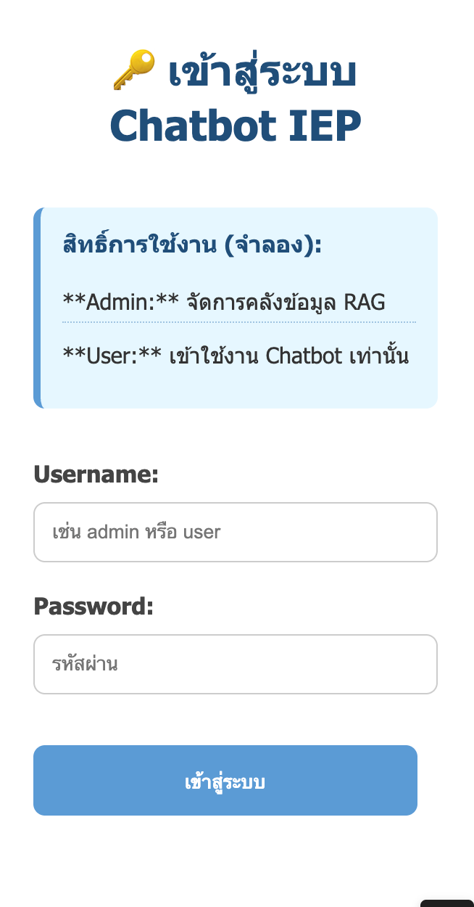
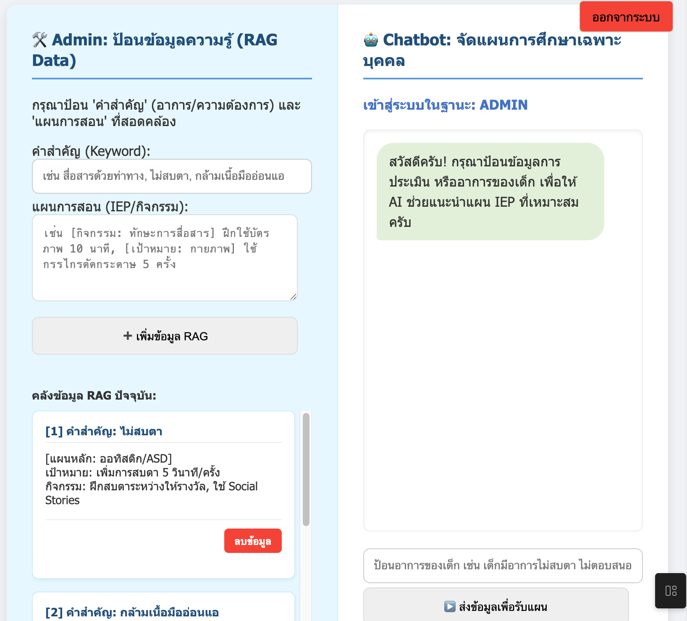
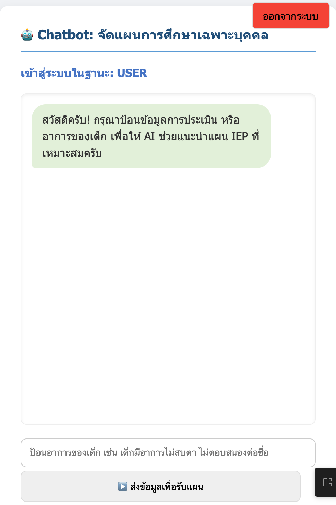

ข้อเสนอโครงการ
วิชา CP413601 การประยุกต์ใช้งานปัญญาประดิษฐ์ในกิจการสาธารณะ

สมาชิกในกลุ่ม
ลำดับ
รหัส
ชื่อ-นามสกุล
1
663380037-0
นายปิยภัทร รัตนรักษ์
2
663380284-3
นางสาวพัชรากร อาจสม
3
663380300-1
นายอธิป ภูมิลา
4
663380303-5
นายอัษฎาวุธ เรือนแก้ว
5
663380521-5
นางสาวตรีรัตน์ ประภา

อาจารย์ที่ปรึกษา:  

1. ชื่อโครงการ (Project Title)
แชทบอทแนะนำแผนการจัดการศึกษาเฉพาะบุคคล (IEP) สำหรับเด็กพิเศษทุกประเภท โดยใช้เทคโนโลยีปัญญาประดิษฐ์ (AI)
2. ความเป็นมาของปัญหาและความสำคัญ (Background & Problem Statement)
ปัญหาในกิจการสาธารณะที่ต้องการแก้ไข
การจัดทำแผนการจัดการศึกษาเฉพาะบุคคล (IEP) ให้กับเด็กพิเศษทุกประเภท (ตาม พ.ร.บ. การจัดการศึกษาฯ) เป็นกระบวนการที่ซับซ้อนและต้องใช้เวลามาก เนื่องจากความต้องการของเด็กแต่ละประเภทความพิการมีความแตกต่างกันสูง
สถานการณ์ ปัจจุบัน ข้อมูลเชิงสถิติ ถ้ามี
ครูที่สอนการศึกษาพิเศษต้องใช้เวลาจำนวนมากในการวิเคราะห์ข้อมูลการประเมินเด็กและค้นหากิจกรรมที่เหมาะสมจากคู่มือหรือเอกสารจำนวนมาก ซึ่งทำให้เหลือเวลาสำหรับการสอนจริงน้อยลง คุณภาพของ IEP จึงไม่เป็นมาตรฐานเดียวกัน
ผลกระทบต่อประชาชน หน่วยงาน หรือสังคม
หาก IEP ไม่เหมาะสมกับความต้องการเฉพาะทางของเด็กแต่ละคนอย่างแท้จริง จะส่งผลให้เด็กพิการไม่สามารถพัฒนาทักษะได้เต็มศักยภาพ (Underachieve) และเพิ่มภาระงานเอกสารแก่บุคลากรทางการศึกษาอย่างต่อเนื่อง
เหตุผลว่าทำไมต้องใช้ AI / เทคโนโลยี
เนื่องจากข้อมูลรายงานการประเมินเป็นข้อมูลข้อความ (Text Data) จำนวนมาก การใช้ AI โดยเฉพาะ Natural Language Processing (NLP) จะสามารถวิเคราะห์ แยกแยะความต้องการ และสร้างข้อเสนอแนะของเป้าหมายและกิจกรรมได้อย่างอัตโนมัติและรวดเร็ว
คำถาม:
 “ถ้าไม่ทำโครงการนี้ จะเกิดผลกระทบอะไร?”
ตอบ การจัดทำแผนการศึกษาเฉพาะบุคคลจะยังคงไม่มีประสิทธิภาพเท่าที่ควร ทำให้โอกาสในการพัฒนาศักยภาพของเด็กพิเศษถูกจำกัด และครูยังคงมีภาระงานที่สูง
3. วัตถุประสงค์ของโครงการ (Objectives)
เพื่อพัฒนาโมเดล AI สำหรับการศึกษาของเด็กพิเศษรายบุคคล
เพื่อสร้างระบบต้นแบบที่สามารถออกแบบแผนการศึกษาที่เหมาะกับเด็กพิเศษแต่ละบุคคล
เพื่อเพิ่มประสิทธิภาพและลดภาระของคุณครูในการจัดทำแผนการศึกษาให้เหมาะสมกับแต่ละบุคคล
4. ขอบเขตของโครงการ (Scope)
อธิบายสิ่งที่ระบบสามารถทำได้และไม่ทำ
ขอบเขตด้านข้อมูล
เน้นข้อมูล IEP และรายงานการประเมินของเด็กพิเศษ เช่น สติปัญญา,ออทิสติก, การได้ยิน
ขอบเขตด้านพื้นที่
พัฒนาระบบในรูปแบบ Web Application เพื่อทดสอบกับโรงเรียนนำร่อง
ฟังก์ชันที่จะพัฒนา
แชทบอทสามารถรับข้อมูลประเมินและเสนอแนะเป้าหมายระยะสั้น-ยาว รวมถึงรายการกิจกรรมการสอนที่เหมาะสม
5. ผู้มีส่วนได้ส่วนเสีย (Stakeholder Analysis)
หน่วยงานภาครัฐที่เกี่ยวข้อง: กระทรวงศึกษาธิการ, สำนักงานคณะกรรมการการศึกษาขั้นพื้นฐาน (สพฐ.) – คาดหวังมาตรฐานและประสิทธิภาพในการจัดทำ IEP
ผู้ใช้งานหลัก (End Users): ครูการศึกษาพิเศษ – คาดหวังระบบที่ช่วยลดเวลาทำเอกสารและให้ข้อเสนอแนะที่เชื่อถือได้
ผู้ได้รับประโยชน์ (Beneficiaries): นักเรียนเด็กพิเศษและผู้ปกครอง – คาดหวังการได้รับแผนการสอนที่มีคุณภาพสูงสุด
6. ประโยชน์ที่คาดว่าจะได้รับ (Expected Benefits)
ประโยชน์เชิงสังคม: เพิ่มโอกาสในการพัฒนาทักษะของเด็กพิเศษทุกชนิดอย่างเท่าเทียม
ประโยชน์ด้านประสิทธิภาพงานราชการ: ลดระยะเวลาที่บุคลากรใช้ในการเตรียมเอกสาร
ประโยชน์ด้านข้อมูล (Data Utilization): สร้างคลังข้อมูลเป้าหมายและกิจกรรมการสอนที่นำไปใช้ต่อยอดได้
ประโยชน์ด้านเวลา: ช่วยให้ครูมีเวลาทุ่มเทให้กับการสอนและการดูแลเด็กมากขึ้น
7. ข้อมูลและแหล่งข้อมูล (Dataset Description)
แหล่งข้อมูล: เอกสาร IEP ย้อนหลัง และรายงานการประเมินพัฒนาการจากโรงเรียนจากศูนย์การศึกษาพิเศษ
ประเภทข้อมูล: ข้อมูลประเภท ข้อความ (Text Data)
ขนาด / จำนวน record: ตั้งเป้าหมายรวบรวมข้อมูลอย่างน้อย ___ ชุด
ข้อจำกัดด้านกฎหมาย: ต้องทำ Anonymization ข้อมูลนักเรียนทั้งหมดอย่างเคร่งครัดตามกฎหมาย PDPA
วิธีการเตรียมข้อมูลเบื้องต้น: ทำความสะอาดข้อมูล (Cleaning) และทำ Labeling เพื่อระบุความสัมพันธ์ระหว่างการประเมิน เป้าหมาย และกิจกรรม
8. แนวทางทางเทคนิค (Technical Approach / Methodology)
ประกอบด้วย:
8.1 ระบบหรือสถาปัตยกรรมเบื้องต้น
แผนผัง: Data (IEP Reports) → Model (NLP)→ Application (CHATBOT)
8.2 การเลือกโมเดล/อัลกอริทึม
Natural Language Processing (NLP)
เหตุผลที่เลือกโมเดลนี้: โมเดล Sequence-to-Sequence เช่น Fine-tuned T5 เหมาะสำหรับการวิเคราะห์ข้อความที่ซับซ้อน (รายงานประเมิน) และสร้างผลลัพธ์ที่เป็นข้อความใหม่ (เป้าหมาย IEP)
8.3 ขั้นตอนการพัฒนา
Data Preparation รวบรวมและคัดแยกข้อมูล
Model Training ฝึกฝนและปรับแต่งโมเดล AI
Model Evaluation ประเมินความแม่นยำของข้อเสนอแนะ
Deployment นำระบบไปติดตั้งบนแพลตฟอร์มเว็บเพื่อทดสอบ
9. การออกแบบระบบต้นแบบ (Prototype Design)
ประกอบด้วย:
User Flow - ครู Login → ป้อนรายงานประเมินเด็ก → Chatbot วิเคราะห์และค้นหาข้อมูล RAG → เสนอเป้าหมายและกิจกรรม → ครูบันทึกร่าง IEP
System Flow Diagram
UI/UX Wireframe - Login Page: หน้า Login แยกสิทธิ์ Admin/User
Admin Panel: มีส่วนสำหรับ เพิ่มข้อมูล (Input) และแสดงผลข้อมูล RAG ในรูปแบบ Card พร้อมปุ่ม ลบ (Delete) 
User Panel: หน้า Chat Interface สำหรับป้อนข้อมูลและรับคำแนะนำ IEP
ตัวอย่างหน้าจอ
Login Page

Admin Panel

User Panel

10. แผนการดำเนินงาน (Work Plan & Timeline)
Phase 1: Data Preparation & RAG Setup 
Phase 2: Modeling & Fine-tuning (LLM)
Phase 3: Prototype Development (Web App)
Phase 4: Testing & Evaluation
11. แผนบริหารความเสี่ยง (Risk Management)
ได้ข้อมูลไม่ครบ - ใช้เทคนิค Data Augmentation และขอข้อมูลจากหลายหน่วยงาน
โมเดลแม่นยำไม่เพียงพอ  - ปรับปรุงคุณภาพการติดป้ายกำกับข้อมูล (Labeling) และใช้ Human-in-the-Loop Feedback ในการปรับปรุงโมเดล
ข้อจำกัดทางกฎหมาย - ทำ Anonymization ข้อมูลอย่างเคร่งครัดและจัดทำข้อตกลงการใช้ข้อมูล
12. เครื่องมือและเทคโนโลยีที่จะใช้ (Tools & Technologies)
Python, PyTorch, TensorFlow
FastAPI, Node.js (สำหรับ API Gateway)
PostgreSQL, MongoDB (สำหรับการจัดเก็บข้อมูล)
GitHub, Figma, Docker
Platform: Web Application
13. งบประมาณ (ถ้าจำเป็น)
ในโครงงานนักศึกษาอาจรวมถึง:
ค่า Cloud
ค่า API Credits
14. เอกสารอ้างอิง (References)
พระราชบัญญัติการจัดการศึกษาสำหรับคนพิการ พ.ศ. 2551
(อ้างอิงงานวิจัยที่เกี่ยวข้องกับการใช้ AI/NLP ในการศึกษา)
(อ้างอิงคู่มือ/หลักสูตรการศึกษาพิเศษที่ใช้เป็นฐานข้อมูล)
